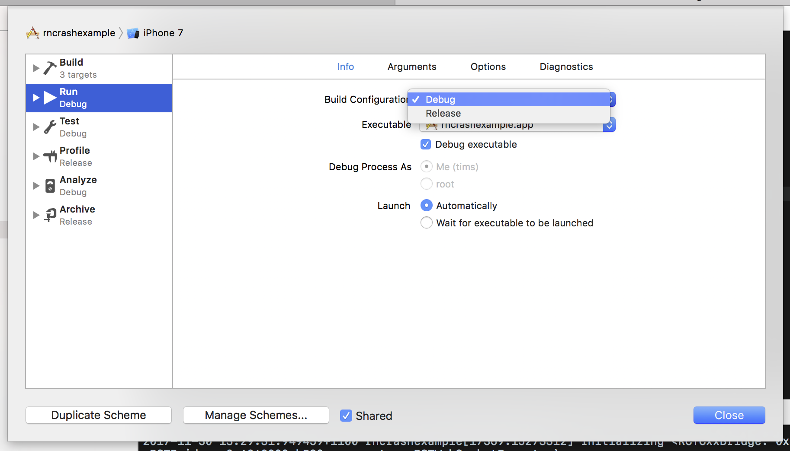

Clone repo

yarn install

Open Xcode, Run. All should be good.

Change the target (rncrashexample)'s scheme's Build Configuration from debug to release.

Run the app and watch it crash.

Look in NativeView.m for details.

